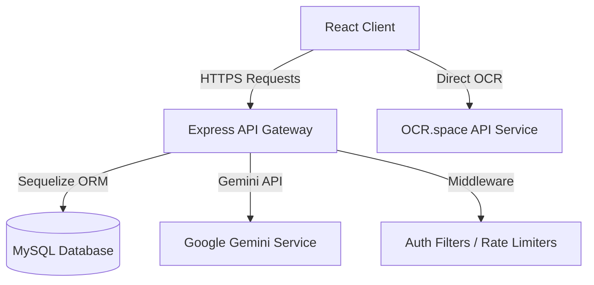

# MediShield AI

AI-Powered Secure Healthcare Management Platform

MediShield AI is a comprehensive, enterprise-grade full-stack application designed to assist patients in medication scheduling, compliance tracking, and emergency alert signaling, while enabling caregivers and administrators to monitor adherence, generate compliance reports, and ensure overall user safety in a secure, role-based environment.

> [!WARNING]
> **HEALTHCARE DISCLAIMER:** MediShield AI provides informational and medication-management assistance only. It is not a replacement for professional medical diagnosis, treatment, or emergency medical care. The AI assistant does not claim to diagnose diseases or replace medical practitioners. For emergency health situations, please contact local emergency services or professional clinicians immediately.

---

## 1. Project Overview
Many patients struggle to follow their medical prescriptions, resulting in missed doses, prolonged illnesses, and preventable hospitalizations. MediShield AI solves this by introducing a robust scheduling system, an interactive AI health assistant, caregiver monitoring integration, and an emergency SOS alert mechanism, backed by advanced web security measures.

## 2. Problem Statement
Medication non-adherence is a major health crisis affecting millions of individuals globally. Patients—especially elderly ones or those with complex chronic illnesses—frequently miss their medication timings due to forgetfulness, lack of guidance, or poor coordination with their primary caregivers.

## 3. Solution
MediShield AI provides an intuitive dashboard where patients can catalog medications, receive timely notifications, scan physical prescriptions into digital schedules using OCR + AI, and consult a multilingual AI health assistant. Caregivers are kept in the loop with real-time missed medication logs and SOS alerts.

## 4. Key Features
- **Medication Scheduling & Compliance Tracker**: Daily visual checklist for tracking doses taken or missed.
- **Interactive Multilingual AI Assistant**: Chat with a medical advisor trained in English, Tamil, and Hindi.
- **Smart Prescription Scanner**: Instant extraction of medications, dosages, and schedules from printed prescriptions using OCR.
- **Caregiver Collaboration**: Direct patient monitoring, automated email/dashboard alerts for missed doses.
- **Emergency SOS Panic Trigger**: Instantly notify registered caregivers and admins in case of emergencies.
- **Admin Analytics Dashboard**: System-wide statistics on active users, login locations, security audits, and rate-limiting alerts.

## 5. User Roles & Workflows

### A. Patient
* **Medicine Scheduling**: Add medicine name, custom dosages, frequency, specific timings, and intake instructions.
* **Adherence Logs**: Mark medicine as "taken" or "missed", updating weekly completion metrics.
* **AI Health Assistant**: Ask questions about side-effects, interactions, or healthy living.
* **Prescription Scanner**: Upload a prescription image to automatically populate schedules.
* **Emergency SOS**: Trigger a quick-action SOS card that fires real-time alerts.

### B. Caregiver
* **Patient Assignment**: Pin assigned patients using their patient IDs.
* **Real-time Monitoring**: Monitor medication history, weekly compliance scores, and recent activities.
* **Emergency Dashboard**: Highlight active patient SOS alarms with priority panels.
* **Activity Log & Timeline**: Historical record of every dose taken or missed.

### C. Admin
* **User Management**: View, add, or suspend accounts (Patients, Caregivers, and Admins).
* **System Security Audits**: Track suspicious access attempts, failed logins, and rate-limiting violations.
* **Analytics**: Global breakdown of active reminders, system health, and server uptimes.

## 6. AI Features
- **Gemini Health Assistant**: Utilizes Google Gemini Pro to answer queries, explain prescriptions, and provide healthy habit suggestions.
- **Multilingual Recognition**: Supports conversing in **English**, **Tamil (தமிழ்)**, and **Hindi (हिन्दी)** natively.
- **Prescription Parsing**: Uses OCR text output combined with Gemini structured JSON generation to map noisy, garbled prescription text to actual normalized drug names and dosages.

## 7. Cybersecurity Features
- **Role-Based Access Control (RBAC)**: Enforced backend endpoint validation ensuring patients, caregivers, and admins cannot cross-access unauthorized records.
- **Secured Credentials**: Passwords stored using industry-standard **bcrypt** hashing.
- **JWT Authentication**: Secure state management utilizing JSON Web Tokens with a 30-day expiration period.
- **API Security Headers**: Configured using **Helmet** to mitigate XSS, Clickjacking, and MIME sniffing attacks.
- **Rate Limiting**: Enforced rate limits on public authorization (`/api/auth/*`) and AI routes to prevent brute-force attacks and resource exhaustion.
- **Audit Trails**: Security actions logged to internal audit journals for admin review.

## 8. Technology Stack
* **Frontend**: React.js (Vite), Tailwind CSS, Framer Motion, Lucide icons, Recharts.
* **Backend**: Node.js, Express.js.
* **Database & ORM**: MySQL database, Sequelize ORM.
* **APIs**: Google Gemini Developer API, OCR.space API.
* **Testing Framework**: JUnit 5, Mockito, Spring Boot Test, REST Assured, Selenium WebDriver, TestNG, Extent Reports (all managed via root Maven wrapper).

---

## 9. System Architecture


---

## 10. Environment Variables
To run this application in production, you must set the following environment variables:

### Backend Variables (`backend/.env`)
```env
PORT=5000
DB_HOST=localhost
DB_PORT=3306
DB_NAME=medishield
DB_USER=root
DB_PASS=your_mysql_password
JWT_SECRET=your_jwt_secret_token
GEMINI_API_KEY=your_gemini_api_key
OCR_API_KEY=your_ocr_space_api_key
FRONTEND_URL=your_deployed_frontend_url
```

### Frontend Variables (`frontend/.env`)
```env
VITE_API_URL=your_deployed_backend_api_url
VITE_OCR_API_KEY=your_ocr_space_api_key
```

---

## 11. Installation & Local Development

### Prerequisites
* **Node.js** (v18.x or higher)
* **MySQL Server** (running on port 3306)
* **Java JDK 17+** & **Maven 3.8+** (only if running the testing suite)

### Step 1: Initialize Database
Ensure MySQL is running, then configure credentials in `backend/.env`. Create the database:
```bash
cd backend
node init-db.js
```

### Step 2: Start Backend
```bash
cd backend
npm install
npm run dev
```
The server will run on `http://localhost:5000`.

### Step 3: Start Frontend
```bash
cd ../frontend
npm install
npm run dev
```
The client will run on `http://localhost:5173`.

---

## 12. Deployment
Detailed instructions for cloud deployment to Vercel, Render, and cloud database instances can be found in [DEMO_SETUP.md](file:///c:/AI%20emergency%20detection%20system/DEMO_SETUP.md).
